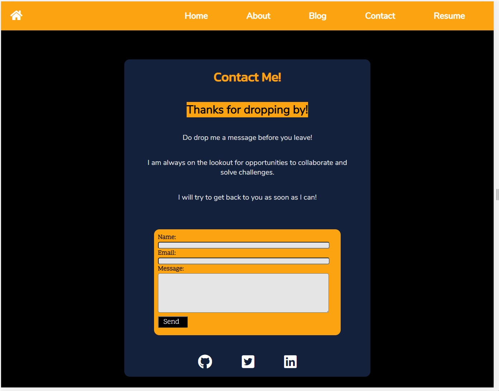

# Joon Yeap Derrick Lai T1A2

## URL

- [derricklai.netlify.app](https://derricklai.netlify.app/)

## Ed Workspace URL

- [Ed workspace link](https://edstem.org/courses/4464/workspaces/pJdrBbwVt3WRBPjckBul4sxPDyQAoBnp)

## Purpose

#### The purpose of this portfolio website is to showcase myself to people that visits my website. The design of this website mainly consists of different colours that works really well on top of each other, while keeping it a clean, simple and well designed website. 

## Funtionality / features

#### The portfolio includes the following features:
- #### Side/top navbar
- #### Animated start button
- #### Form submission using formspree
- #### Cards for blog posts
- #### Containers for content
- #### Resume button that links to an external site with PDF version of CV

### Sitemap

### Screenshots

#### Animated start button on landing page

#### Mobile

#### Desktop

##### The animated start button using fontawesome symbol along with pseudoclasses such as :hover and :after. Using the hover effect, the background colour of the start button will change from orange-web colour into a platinum colour. With the after effect, the font awesome arrow shows up as well. 

#### Side navbar in mobile and top navbar in desktop

#### Mobile

#### Desktop

##### The navbar is made using css flexbox and very simple javascrpit. While the display width is < 800px, the navbar functions as a side navbar that slides in and out upon clicking the 'burger' icon. While the display width is > 800px, the navbar appears on top with all the navigations link shown. 

## Target audience

#### The target audience for this portfolio are mainly potential employers that finds my design to be appealing or other potential customers/developers that are in need of my service to design a website.  

## Tech Stack

#### The tech stacks that were used in this portfolio assignment are:
- #### HTML5
- #### CSS3
- #### Javascript
- #### Sass

